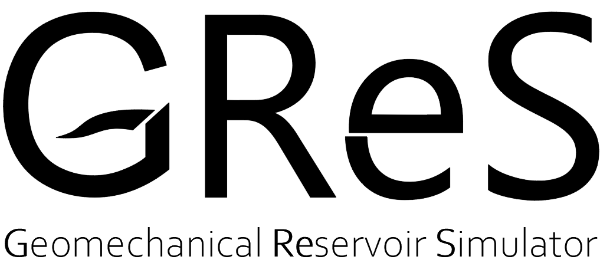

# GReS
Welcome to GReS, the **G**eomechanical **Re**servoir **S**imulator developed at the University of Padova.

GReS is a robust simulator that puts a strong emphasis on geomechanics while also incorporating various other physics such as singlephase flow, multiphase flow and thermal dynamics.

Written in MATLAB, GReS offers maximum flexibility and has been designed to lower the entry barrier for new users, making it accessible to a wide range of researchers and professionals.

We invite you to explore GReS and leverage its powerful capabilities for your geomechanical reservoir simulation needs. Feel free to reach out with any questions or feedback - we are here to support you on your simulation journey.

## Publications ##

ArXiv link to a publication describing a novel interpolation strategy fot the mortar method:
http://arxiv.org/abs/2409.11735

## Main contributors ##

The code is developed by the research group in Numerical Analysis at University of Padova, under the leadership of Prof. Massimiliano Ferronato. The active members dedicated to this project are:

* Daniele Moretto (PhD student at University of Padova)
* Andrea Franceschini (assistant professor at University of Padova)

Past members:

* Stefano Nardean (currently at ENI)
* Angelica Righetto (former master student at University of Padova)
